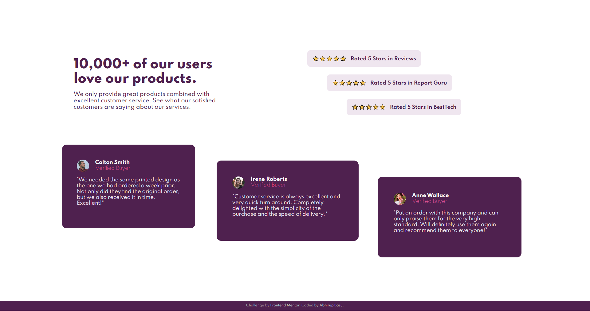

# Frontend Mentor - Social proof section solution

This is a solution to the [Social proof section challenge on Frontend Mentor](https://www.frontendmentor.io/challenges/social-proof-section-6e0qTv_bA). Frontend Mentor challenges help you improve your coding skills by building realistic projects. 

## Table of contents

- [Overview](#overview)
  - [Screenshot](#screenshot)
  - [Links](#links)
  - [Built with](#built-with)
  - [What I learned](#what-i-learned)
  - [Useful resources](#useful-resources)
- [Author](#author)

## Overview


### Screenshot




### Links

- Solution URL: [GitHub](https://github.com/basuabhirup/social-proof-section)
- Live Site URL: [Vercel](https://social-proof-section-basuabhirup.vercel.app/)

## My process

### Built with

- HTML5
- CSS3
- CSS Grid


### What I learned

Gained experience in working with CSS grid layout. Also I used the html span elements to group and seperate sentences to make them adaptable with the screen width resolution.


```html
    <section class="ratings">
      <h4 class="rating1"> ⭐⭐⭐⭐⭐ &nbsp; <span class="ratingText">Rated 5 Stars in Reviews</span></h4>
      <h4 class="rating2"> ⭐⭐⭐⭐⭐ &nbsp; <span class="ratingText">Rated 5 Stars in Report Guru</span></h4>
      <h4 class="rating3"> ⭐⭐⭐⭐⭐ &nbsp; <span class="ratingText">Rated 5 Stars in BestTech</span></h4>
    </section>
```
  
```css
.ratingText {
  display: inline-block;
  min-width: 100px;
}
```


### Useful resources

- [W3 Schools](https://www.w3schools.com/cssref/default.asp) 
- [Mozilla Developer Network](https://developer.mozilla.org/en-US/docs/Learn) 
- [DevDocs](https://devdocs.io/css/)


## Author

### __Abhirup Basu__

- GitHub - [@basuabhirup](https://github.com/basuabhirup)
- LinkedIn - [@basu-abhirup](https://www.linkedin.com/in/basu-abhirup/)
- Frontend Mentor - [@basuabhirup](https://www.frontendmentor.io/profile/basuabhirup)
- Twitter - [@basu_abhirup27](https://www.twitter.com/basu_abhirup27)
